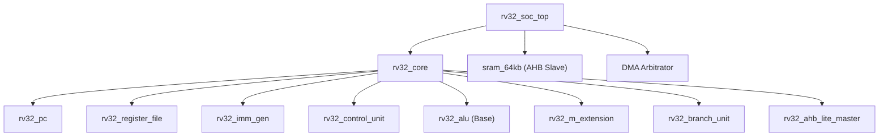

# 🚀 Single-Cycle RV32IM RISC-V CPU Core


This repository contains a fully synthesizable, single-cycle RISC-V processor implementing the **RV32IM** instruction set architecture. Designed with a focus on simplicity, area optimization, and educational clarity, this core is targeted for synthesis on a **65nm SCL CMOS** ASIC node. 

The design relies on a pure single-cycle execution model without pipelined registers, completing operations in one clock cycle via a combinational datapath. It also features a memory-mapped AHB-Lite bus interface, a scalable 64 KB SRAM module, hardware DMA support, and external interrupt capabilities.

---

## ✨ Key Features

- **RV32I Base Integer Instruction Set**: Full support for standard 32-bit RISC-V integer instructions.
- **M-Extension (Modular)**: Includes an atomic, toggleable block for hardware multiplication and division instructions (`MUL`, `DIV`, `REM`, etc.).
- **Single-Cycle Datapath**: Purely combinational data path; all instructions process in a single clock edge.
- **Custom AHB-Lite Bus Master**: Native support for single-transfer bus protocol interactions for straightforward integration with SoCs.
- **DMA & Interrupt Support**: Built-in logic for Direct Memory Access (DMA) holding/stalling and active-high interrupt request (IRQ) vectoring.
- **SystemVerilog 2012**: Clean, modular, and readable codebase conforming to modern IEEE 1800-2012 SystemVerilog standards.

---

## 📂 Repository Structure

```text
.
├── rtl/                        # Synthesizable SystemVerilog RTL files
│   ├── pkg_rv32_types.sv       # Shared types, structs, enums, and parameters
│   ├── rv32_ahb_lite_master.sv # AHB-Lite master interface
│   ├── rv32_alu.sv             # Arithmetic Logic Unit
│   ├── rv32_branch_unit.sv     # Branch target and condition evaluator
│   ├── rv32_control_unit.sv    # Main decoder & control signal generator
│   ├── rv32_core.sv            # CPU Top-Level (Datapath + Control)
│   ├── rv32_imm_gen.sv         # Immediate generator
│   ├── rv32_m_extension.sv     # Hardware M-extension (Multiplier/Divider)
│   ├── rv32_pc.sv              # Program Counter and next-PC logic
│   ├── rv32_register_file.sv   # 31-word 32-bit Async Read / Sync Write RF
│   └── rv32_soc_top.sv         # SoC Top-Level (incorporating Core, SRAM, DMA logic)
│
├── tb/                         # Testbenches and Simulation
│   └── rv32_tb.sv              # Preloaded firmware and self-checking core verification
│
├── files.txt                   # List of source files for easy compilation
├── sim.out                     # Pre-compiled Icarus Verilog standard simulation runtime
├── infinity_sim.out            # Pre-compiled Icarus Verilog continuous simulation runtime
└── README.md                   # Project documentation
```

---

## 🏗️ Architecture & Module Hierarchy



The **longest combinational critical path** runs from the Program Counter module into instruction memory decode, through register read, ALU execution, data memory logic, and finishes back at the register write-back mux.

---

## 🚀 Getting Started

### Prerequisites

To simulate this design offline, you will need a SystemVerilog simulator. [Icarus Verilog (`iverilog`)](http://iverilog.icarus.com/) is recommended for quick, open-source verification. Alternatively, tools such as Verilator, Synopsys VCS, or QuestaSim can be used.

### Compilation & Simulation

1. **Clone the repository:**
   ```bash
   git clone https://github.com/your-username/rv32im-single-cycle.git
   cd rv32im-single-cycle
   ```

2. **Compile the RTL and Testbench using Icarus Verilog:**
   You can compile the design conveniently using the provided `files.txt` list:
   ```bash
   iverilog -g2012 -o sim.out -f files.txt
   ```
   *(Note: Pre-compiled runtimes `sim.out` and `infinity_sim.out` are already included in the repository for immediate testing).*

3. **Run the simulation:**
   ```bash
   vvp sim.out
   ```

4. **Expected Output:**
   The testbench comes with a pre-loaded hand-assembled binary program that tests core functionality (ALU ops, Branches, Memory Read/Writes). If successful, you should see structural console logs concluding with `TEST PASSED`.

---

## 🛠️ Physical Synthesis 

This core was developed to act as an architectural baseline for synthesis with the **65nm SCL CMOS** PDK.  
- Because the design is single-cycle, maximizing achievable frequency relies exclusively on standard cell optimization across the critical operational path. 
- The `rv32_m_extension` is modular: it evaluates an `m_valid` enable flag from the main control unit, and can be pruned easily in area-constrained implementations.

---

## 📝 License

This project is licensed under the [MIT License](LICENSE).
